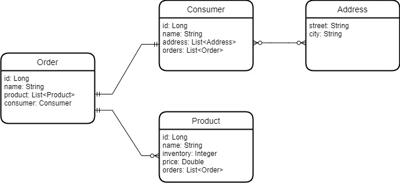

# Projeto JpaRepositry

    Este projeto foi feito para a disciplina PERSISTENCE do curso de 
    MBA EM FULL STACK DEVELOPMENT - DESIGN, ENGINEERING & DEPLOYMENT
    da turma 43scj.

    Nesse projeto é uma API foi feito em JAVA(version 11) com springboot framework onde é simulado
    um ambiente de vendas através de rotas e salvando os dados com SQL.

    As rotas existentes no serviço são:
    GET  ->  getAll        -> /{id}
    POST  ->  addOrder     -> /

    No serviço possuimos as entidades Consumer(consumidor), Order(pedido) e Product (produto);

    Diagrama de classes: 

    Os consumidores possuem suas proprias informações e
    também possuem orders e um endereço.
    Uma order possui produtos e cada produto é composto por  name, inventory, quantity e price.

    O fluxo de compra é feito chamando a rota POST ( / ) e dessa forma temos um pedido
    cadastrado. O corpo Json necessário para executar a requisição é:
    {
        consumerId: Number,
        products: [
            Number
        ]
    }

    Para configurar o ambiente do Mongo Database é necessário criar o arquivo
    application.properties com os dados:

    spring.datasource.url=
    spring.datasource.username=
    spring.datasource.password=
    
    spring.h2.console.enabled=true
    spring.h2.console.path=/h2-console
    
    spring.jpa.show-sql=true
    spring.jpa.properties.hibernate.format_sql=true
